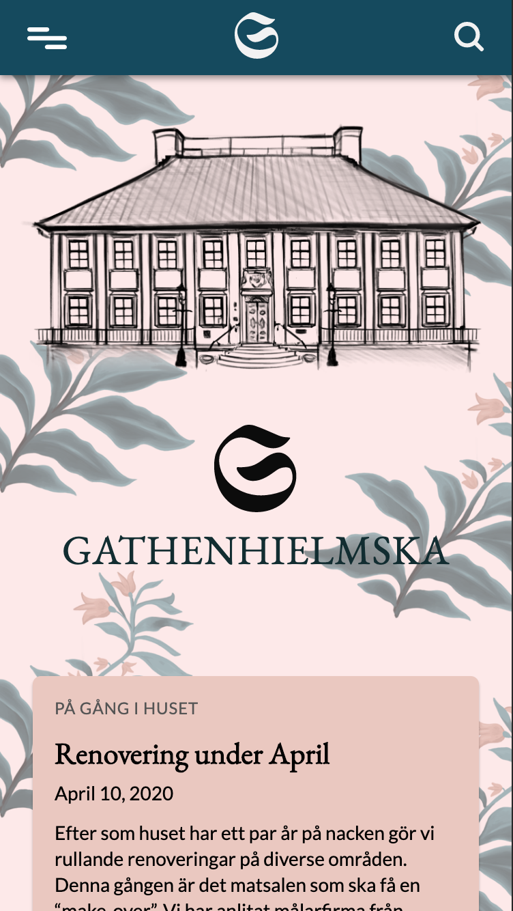

<p align="center">

</p>

## Gathenhielmska, a Wordpress project

We have under four weeks been working on a project for Gathenhielmska huset in Gothenburg.
This is a sharp customer project that we have been working on together with Digital Designers @ Yrgo. 

The project is Wordpress based, and also written in HTML, CSS and Javascript.

## Requirements

* Mobile first landing page
* News page
* Calendar page, with events, booking system
* Contact form
* Language versions
* Search function
* Header
* Footer

## Getting started

1. Clone/Download the project

2. In the terminal change directory to the cloned project and run

```
- $ composer install
- $ npm install
```

3. Add a .env file and fill according to .env.example or follow [wordplateconfiguration](https://wordplate.github.io)
4. Start a local webbserver in the public folder.
5. In the terminal run:

```
$ npm run watch
```

or 

```
$ npm run dev
```

6. Open the server in browser and install WordPress and try out the theme!

## System Requirements

- Composer requires PHP 5.3.2+
- Recommended version of [node](https://nodejs.org/en/)

## Authors

### Web developers

- [Henric Björkvall](https://github.com/henricbjork)
- [Viktor Puke](https://github.com/vpuke)

### Digital Designers

- Sally Lidholm Ström
- Marcus Sjöholm

## Documentation for wordplate
Visit the [official documentation](https://wordplate.github.io/) page if you want to dive right in and start building WordPress applications with WordPlate. The documentation is thorough, complete, and makes it a breeze to get started learning WordPlate.
